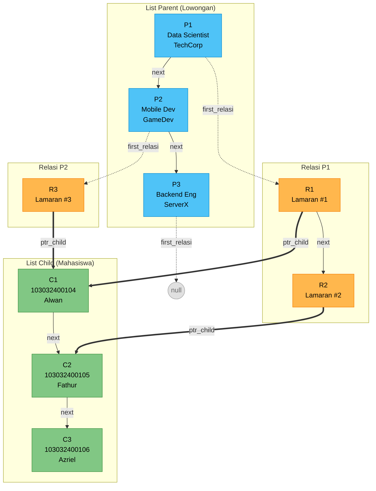
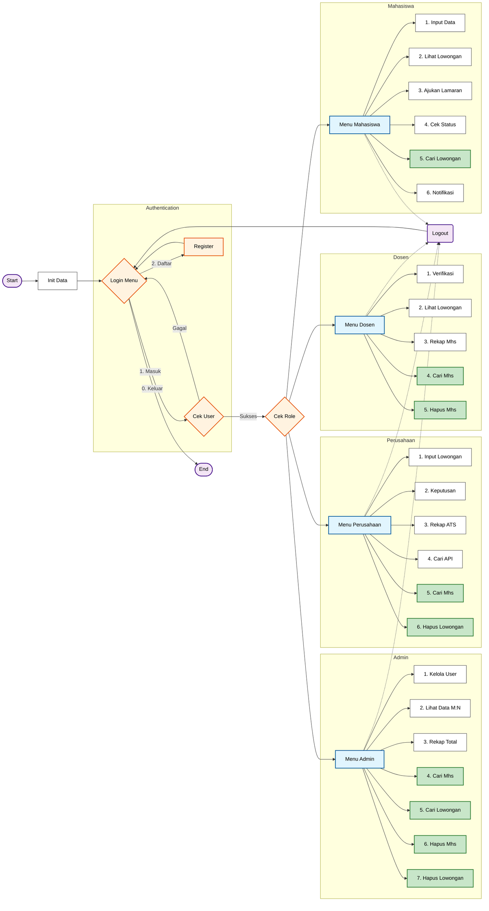

# Sistem Layanan Magang (ATS) - MLL Tipe B


Sistem Layanan Magang adalah aplikasi berbasis konsol (CLI) yang dibangun menggunakan bahasa C++ untuk memfasilitasi proses pelamaran kerja magang mahasiswa. Sistem ini menggunakan struktur data **Multi-Linked List (MLL)** untuk mengelola relasi antara Lowongan (Parent) dan Pelamar (Child).

## 🚀 Fitur Utama

### 1. Multi-Role System
- **Mahasiswa**: Input data diri, melihat lowongan, upload CV, cari lowongan, dan menerima notifikasi penerimaan.
- **Dosen**: Memverifikasi lamaran, cari mahasiswa, hapus mahasiswa, dan melihat rekapitulasi pelamar.
- **Perusahaan**: Membuka lowongan, melihat skor ATS pelamar, review CV, cari mahasiswa, hapus lowongan, dan memberikan keputusan (Terima/Tolak).
- **Admin**: Mengelola user, cari/hapus mahasiswa, cari/hapus lowongan, dan melihat seluruh data sistem.

### 2. Applicant Tracking System (ATS) 🤖
- **CV Scoring**: Sistem otomatis memindai file CV (PDF/TXT) untuk mencari kata kunci relevan (misal: "C++", "Teamwork", "Python").
- **Binary Scanning**: Mendukung pembacaan raw content dari file PDF.
- **Skor**: Setiap kata kunci memberikan poin tambahan pada skor pelamar.

### 3. Manajemen File & CV 📂
- **Upload CV**: Mendukung pemilihan file native Windows (File Picker) untuk format `.pdf` dan `.txt`.
- **File Storage Simulation**: File yang diupload otomatis disalin ke folder lokal `uploads/` dengan penamaan terstruktur.
- **Auto-Cleanup**: Folder `uploads/` otomatis dibersihkan saat aplikasi ditutup untuk menghemat penyimpanan.
- **Integrated Review**: Perusahaan dapat membuka file CV pelamar langsung dari aplikasi sebelum memberikan keputusan.

### 4. Notifikasi Real-time 🔔
- Mahasiswa mendapatkan notifikasi "Pesan" di menu utama jika lamaran mereka diterima oleh perusahaan.

## 🛠️ Teknologi yang Digunakan
- **Bahasa**: C++ (Standard Library)
- **Struktur Data**: Multi-Linked List (MLL) Tipe B
- **OS API**: Windows API (`windows.h`, `commdlg.h`) untuk File Dialog dan File Operations.

## 📦 Cara Menjalankan

### Prasyarat
- Compiler C++ (MinGW / G++)
- Sistem Operasi Windows

### Instalasi & Run
1.  Clone repository ini.
2.  **Cara Mudah (Recommended):**
    Cukup klik dua kali file `run.bat` atau jalankan via terminal:
    ```bash
    ./run.bat
    ```
    Script ini akan otomatis melakukan compile dan menjalankan aplikasi.

3.  **Cara Manual (Alternatif):**
    Jika ingin compile sendiri:
    ```bash
    g++ src/*.cpp -Iinclude -o app.exe -lcomdlg32
    ./app.exe
    ```

## 👥 Akun Demo (Login)

| Role | Username | Password |
| :--- | :--- | :--- |
| **Mahasiswa** | `muhamadalwansuryadi` | `0104` |
| **Dosen** | `dosen1` | `dosen123` |
| **Perusahaan** | `techcorp` | `123` |
| **Admin** | `admin` | `admin123` |

## 📝 Struktur Data (MLL Tipe B)

Sistem ini menggunakan **Multi-Linked List Tipe B**, di mana setiap Parent node memiliki pointer ke list relasi-nya sendiri.

### Komponen Utama
- **Parent (Lowongan)**: Linked List berisi data lowongan pekerjaan
- **Child (Mahasiswa)**: Linked List berisi data mahasiswa
- **Relasi (Lamaran)**: List yang *menempel* pada setiap Parent, menghubungkan ke Child

### Visualisasi Struktur MLL Tipe B



### Penjelasan Pointer
| Pointer | Dari | Ke | Fungsi |
|---------|------|-----|--------|
| `next` | Parent/Child/Relasi | Node sejenis berikutnya | Traversal horizontal |
| `first_relasi` | Parent | Relasi pertama | Akses lamaran di lowongan tsb |
| `ptr_child` | Relasi | Child | Menunjuk mahasiswa pelamar |

> **Mengapa Tipe B?** Setiap lowongan (Parent) langsung memiliki akses ke daftar pelamarnya tanpa perlu traversal list relasi global.

## � Fungsi Utama per Modul

### `mahasiswa.cpp`
| Fungsi | Deskripsi |
|--------|-----------|  
| `createListChild()` | Inisialisasi list mahasiswa |
| `alokasiChild()` | Alokasi node baru mahasiswa |
| `insertChild()` | Insert mahasiswa ke list |
| `findChildByNIM()` | Cari mahasiswa berdasarkan NIM |
| `menuCariMahasiswa()` | Menu interaktif pencarian mahasiswa |
| `deleteChildByNIM()` | Hapus mahasiswa beserta semua relasi |
| `cleanupRelasiBeforeChildDeletion()` | Cleanup relasi sebelum hapus child |

### `lowongan.cpp`
| Fungsi | Deskripsi |
|--------|-----------|  
| `createListParent()` | Inisialisasi list lowongan |
| `alokasiParent()` | Alokasi node baru lowongan |
| `insertParent()` | Insert lowongan ke list |
| `findParent()` | Cari lowongan berdasarkan ID |
| `menuCariLowongan()` | Menu interaktif pencarian lowongan |
| `deleteParentByID()` | Hapus lowongan beserta semua lamaran |
| `importLowonganFromAPI()` | Import lowongan dari file hasil API |

### `lamaran.cpp`
| Fungsi | Deskripsi |
|--------|-----------|  
| `insertRelasi()` | Insert lamaran baru (relasi Parent-Child) |
| `editStatusDosen()` | Update status verifikasi dosen |
| `editStatusPerusahaan()` | Update keputusan perusahaan |
| `showStatusLamaranMahasiswa()` | Tampilkan status lamaran per mahasiswa |
| `showRekapLamaranPerusahaan()` | Rekap lamaran dengan ATS Score |
| `countNotifikasi()` | Hitung jumlah notifikasi penerimaan |
| `showNotifikasi()` | Tampilkan detail notifikasi |

## 📊 Alur Program



---
*Dibuat untuk Tugas Besar Struktur Data - Telkom University.*
